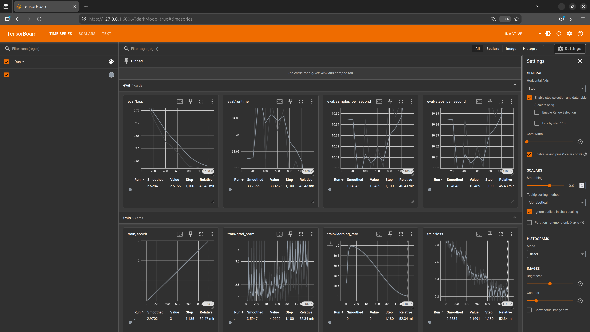

# LoRA 方法介绍
## LoRA （Low-Rank Adapation）原理 

假设原模型权重矩阵是 $W_0$：

$$
W=W_0+ΔW
$$

- $ΔW=A⋅B$

    - *A* 和 *B* 是小矩阵（低秩）
    - 参数量远小于 $W_0$
​
- 微调时只训练 *A*，*B*，保留原始权重 $W_0$ 不动

优势：

- 显存占用低 → 8GB GPU 可以训练 6B~7B 模型
- 可快速训练
- 训练后只保存 LoRA 权重（增量参数），方便推理

## LoRA 在 PEFT 中的使用

在 PEFT 中，使用 LoRA 非常简单，只需设置一个 [LoraConfig](https://huggingface.co/docs/peft/v0.19.0/en/package_reference/lora#peft.LoraConfig) 并将其封装在 [get_peft_model()](https://huggingface.co/docs/peft/v0.19.0/en/package_reference/peft_model#peft.get_peft_model) 函数中即可创建一个可训练的 [PeftModel](https://huggingface.co/docs/peft/v0.19.0/en/package_reference/peft_model#peft.PeftModel)。详细内容可以查看 [Hugging Face PEFT LoRA](https://huggingface.co/docs/peft/main/en/developer_guides/lora) 说明。

### 初始化

在 `LoraConfig` 中，`init_lora_weights` 参数控制 LoRA 权重，不同的参数适应不同的场景：

| 参数值               | 含义 / 初始化行为                                                                 | 官方说明                                                 |
| ----------------- | -------------------------------------------------------------------------- | ---------------------------------------------------- |
| **默认（True 或未设置）** | A 权重用 **Kaiming‑uniform** 初始化，B 权重为 **0**，形成 _identity transform_（输出与输入一致） | PEFT 默认方式，与原始 LoRA 参考实现一致，训练稳定且输出不会偏离原模型。            |
| **`"gaussian"`**  | A 权重用 **高斯（Gaussian/normal）分布** 初始化，B 权重为 **0**                            | 模仿 Diffusers 的 LoRA 初始化方式，可以在某些任务中加速收敛。              |
| **`False`**       | 不做标准初始化（跳过 identity transform 初始化），**适合测试/调试**                             | 不生成 identity 变换，可能随机初始化且不可保证收敛行为。官方建议仅用于验证/测试。       |
| **`"pissa"`**     | 使用 **PiSSA（主奇异值/向量 SVD）** 初始化 LoRA 权重                                      | 利用原模型权重的奇异分解初始化，可提高收敛速度和性能（通常比普通初始化更强）。              |
| **`"corda"`**     | 使用 **CorDA** 初始化，根据任务或世界知识构建任务感知 LoRA                                      | 更强的 task-aware 初始化，可减缓灾难性遗忘/提高性能；需要额外的 CorDA 配置和预处理。 |
| **`"olora"`**     | 使用 **OLoRA（基于 QR 分解）的初始化**                                                 | 通过 QR 分解变换基础权重再初始化 LoRA，可改善稳定性和收敛速度。                 |
| **`"eva"`**       | 使用 **EVA 初始化（基于激活 SVD 和解释方差分配）**                                           | 数据驱动初始化，按解释方差动态分配 rank，在激活上进行 SVD；适合复杂任务/模型结构。       |
| **`"loftq"`**     | 使用 **LoftQ** 初始化专用于量化模型                                                    | LoRA 权重被初始化以最小化量化误差（尤其是 4bit）——在 QLoRA 场景下推荐这种方式。    |

在初始化时，可以根据应用场景选择使用哪一种方式进行初始化：

- **稳定、通用任务**：默认（Kaiming‑uniform）或 `"gaussian"`
- **收敛更快/更精细**：`"pissa"` / `"olora"` / `"eva"`
- **与量化结合**：`"loftq"`
- **调试**：`False`
- **任务感知/避免遗忘**：`"corda"`

对于 LoRA，目前有三种增强/改进策略，它们可以在定义 `LoraConfig` 或 `LoRA layer` 时，对 LoRA 本身的行为做特定处理/增强：

|方法|对 LoRA 的处理类型|应用时机|
|---|---|---|
|**rsLoRA**|修改 scaling factor（α/√r）来稳定训练高 rank LoRA|训练阶段 forward/backward|
|**LoRaQ**|针对量化模型补偿低比特误差，引入额外分支|推理/微调阶段，在量化模型上|
|**LoRA‑GA**|用梯度主方向初始化 LoRA 权重，使训练更快收敛|LoRA 初始化阶段，训练开始前|

### 变体

DoRA (Weight‑Decomposed LoRA) 是 PEFT 官方中明确支持的变体（可通过 `LoraConfig(use_dora=True)` 启用）。

- 本质上分解了权重更新为**方向 + 大小**两部分：

    - 标准 LoRA 负责方向
    - 新增可学习 magnitude 参数负责幅度

- 结果是提高 LoRA 在低 rank 和小参数预算下的学习能力。

与 LoRA 的差异化对比表：

| 特性        | LoRA      | DoRA            | 结论               |
| --------- | --------- | --------------- | ---------------- |
| **参数量**   | r × (m+n) | r × (m+n) + 小增量 | DoRA 略多，但仍低      |
| **训练收敛**  | 标准        | 更快，尤其低 rank     | 小样本或 rank 小时优势明显 |
| **性能**    | 稳定        | 稳定+表达能力增强       | 低 rank/少数据优势大    |
| **显存占用**  | 低         | 略高              | 对极低显存硬件需考虑       |
| **实现复杂度** | 简单        | 稍复杂             | PEFT 只需设置 flag   |
| **量化兼容**  | 易结合 QLoRA | 限制更多            | 极低比特部署不推荐        |

DoRA 的优势在于低 rank 下提升表达能力和收敛速度，但代价是略高的参数量和单步训练开销，量化兼容性也不如 LoRA 灵活。

### QLoRA

QLoRA 并不是一个独立 API，而是在 PEFT 中通过以下方式实现：

- 将模型权重量化（比如 4bit/INT8）
- 对所有线性层应用 LoRA（`target_modules="all-linear"`）
- 目标是：**结合量化和参数高效微调**，显存/计算效率极高

与 LoRA 的差异化对比表：

| 特性    | LoRA            | QLoRA                        |
| ----- | --------------- | ---------------------------- |
| 权重类型  | FP16/FP32 原始权重  | 量化权重（4bit/8bit）              |
| 显存占用  | 较高              | 极低（4~8 倍节省）                  |
| 可训练参数 | LoRA adapter    | LoRA adapter（参数量同样低）         |
| 推理性能  | 与原模型相同          | 高效，量化推理快                     |
| 适用场景  | 单机/多卡 GPU       | 单卡低显存、大模型微调                  |

###  优化器

目前 PEFT 支持 LoRa-FA 和 LoRa+。

使用 LoRA-FA 可以更高效地进行 LoRA 训练。LoRA-FA 通过固定矩阵 A 并仅调整矩阵 B 来降低激活内存消耗。在训练过程中，B 的梯度被优化以逼近完整的参数微调梯度。此外，LoRA-FA 的内存消耗对秩不敏感（因为它会清除矩阵 A 的激活值），因此可以通过增加 LoRA 秩来提高性能而不会增加内存消耗。

使用LoRA+ 可以优化 LoRA 训练，LoRA+ 对适配器矩阵 A 和 B 使用不同的学习率，结果表明，微调速度可提高 2 倍，性能可提高 1-2%。

### LoRA 微调操作说明
#### 安装环境

使用 PEFT 库做 LoRA 微调，则最少需要安装三个必要的库：

```bash
pip install transformers peft datasets
```

#### 使用说明

LoRA 微调遵循下面的代码骨架，这不是一个完整可用的代码模版，但却明确表达了在 peft 中进行 lora 微调需要的操作步骤：

```python
# ---------------------------
# 1️⃣ 导入必要库
# ---------------------------
from transformers import AutoTokenizer, AutoModelForCausalLM, Trainer, TrainingArguments, DataCollatorForSeq2Seq
from peft import LoraConfig, get_peft_model
from datasets import load_dataset

# ---------------------------
# 2️⃣ 加载 tokenizer
# ---------------------------
tokenizer = AutoTokenizer.from_pretrained(...)

# ---------------------------
# 3️⃣ 加载并处理数据集
# ---------------------------
dataset = load_dataset(...)

# ---------------------------
# 4️⃣ 加载原模型（冻结大部分参数）
# ---------------------------
model = AutoModelForCausalLM.from_pretrained(...)

# ---------------------------
# 5️⃣ 配置 LoRA 微调
# ---------------------------
lora_config = LoraConfig(...)

model = get_peft_model(model, lora_config)

# ---------------------------
# 6️⃣ 数据整理器（batch）
# ---------------------------
data_collator = DataCollatorForSeq2Seq(...)

# ---------------------------
# 7️⃣ 配置训练参数
# ---------------------------
training_args = TrainingArguments(...)

# ---------------------------
# 8️⃣ Trainer
# ---------------------------
trainer = Trainer(
    model=model,
    args=training_args,
    train_dataset=dataset,
    tokenizer=tokenizer,
    data_collator=data_collator
)

# ---------------------------
# 9️⃣ 开始训练
# ---------------------------
trainer.train()

# ---------------------------
# 🔟 保存 LoRA 权重
# ---------------------------
model.save_pretrained(...)
```

##### Tokenizer

Tokenizer 是用于将自然语言转化为 token 的关键环节，对于一个模型而言，在对其进行微调时，要使用其同等的 emebdding 和 padding 方式，才能让模型正确的识别训练的文本对象。

使用 `AutoTokenizer.from_pretrained` 初始化 tokenizer 时，实际是在加载对应模型处理自然语言的方式，在处理训练/验证数据集时，就需要使用 tokenizer 处理原始数据，让它变成可以被模型正确识别的 token 序列。

通常你可以使用 `AutoTokenizer.from_pretrained(model_name)` 直接定义 tokenizer ，但如果目标模型带有自定义的 Tokenizer 类，则需要使用 `trust_remote_code=True`，否则就会报错。

初始化 tokenizer 后，还需要根据模型类型，设置 `padding` 方式，有些模型并不带有 `pad_token`，而且对于自回归语言模型而言，必须选择在右侧填充（自回归模语言型需要左侧的 token 来预测右侧的内容）。

因此，对自回归语言模型而言，初始化函数通常如下：

```python
def load_tokenizer(model_name):
    tokenizer = AutoTokenizer.from_pretrained(model_name, trust_remote_code=True)
    if tokenizer.pad_token is None:
        tokenizer.pad_token = tokenizer.eos_token
    tokenizer.padding_side = "right"
    return tokenizer
```

##### 加载和处理数据集

要加载 Hugging Face 上的数据集，只需要使用 `load_dataset(dataset_name, split="train")` 即可，当然如果你要加载自己的数据集，也可以使用 `load_dataset` 函数，带上文件的类型和路径即可： `load_dataset('csv', data_files='my_data.csv', split='train')`。

加载数据集不是一个重点部分，重点是你需要将加载的数据集，拼凑成训练模型需要的样子， **对于不同用途的模型，你需要拼凑的数据格式是不同的**，这一点尤为重要。

对于 **普通文本生成模型**，其任务是 **文本续写**，数据呈现为 **单条文本，input → target 是同一条文本或上下文 + 续写**，示例代码如下：

```python
from transformers import AutoTokenizer

tokenizer = AutoTokenizer.from_pretrained("gpt2")

example = {
    "Context": "Once upon a time, there was a brave knight",
    "Response": " who fought dragons to protect the kingdom."
}

# 将输入和输出拼接
input_text = example["Context"]
target_text = example["Response"]

input_ids = tokenizer(input_text, truncation=True, max_length=128).input_ids
target_ids = tokenizer(target_text, truncation=True, max_length=128).input_ids

# 构造 labels：只计算 target loss
labels = [-100]*len(input_ids) + target_ids

# attention mask
attention_mask = [1]*len(labels)
```

对于 **对话式模型**，其任务是 **聊天生成**，数据呈现为 **多角色对话，system + user + assistant**，示例代码如下：

```python
from transformers import AutoTokenizer

tokenizer = AutoTokenizer.from_pretrained("Qwen/Qwen2.5-3B-Instruct", trust_remote_code=True)

SYSTEM_PROMPT = "You are a helpful mental health assistant."

example = {
    "Context": "I feel anxious about my exams.",
    "Response": "It's normal to feel anxious. Try some breathing exercises..."
}

# 构造 messages
messages = [
    {"role": "system", "content": SYSTEM_PROMPT},
    {"role": "user", "content": example["Context"]},
    {"role": "assistant", "content": example["Response"]}
]

# 使用 apply_chat_template
ids = tokenizer.apply_chat_template(messages, tokenize=True)

# 假设返回两个部分：prompt_ids 和 full_ids
prompt_ids = tokenizer.apply_chat_template(messages[:-1], tokenize=True, add_generation_prompt=True)
full_ids = tokenizer.apply_chat_template(messages, tokenize=True, add_generation_prompt=False)
target_ids = full_ids[len(prompt_ids):]

input_ids = prompt_ids + target_ids
labels = [-100]*len(prompt_ids) + target_ids
attention_mask = [1]*len(input_ids)
```

对于 **多轮对话模型**，其任务是 **连续多轮对话**，数据呈现为 **历史上下文 + 当前用户问题 + 回复**，示例代码如下：

```python
history = [
    {"role": "user", "content": "Hello!"},
    {"role": "assistant", "content": "Hi, how can I help you today?"}
]

current_input = "I feel stressed about work."
current_response = "It is common to feel stressed. Let's talk through it."

messages = [{"role": "system", "content": SYSTEM_PROMPT}] + history + \
           [{"role": "user", "content": current_input}, {"role": "assistant", "content": current_response}]

# 处理同 apply_chat_template
ids = tokenizer.apply_chat_template(messages, tokenize=True)
prompt_ids = tokenizer.apply_chat_template(messages[:-1], tokenize=True)
full_ids = tokenizer.apply_chat_template(messages, tokenize=True)
target_ids = full_ids[len(prompt_ids):]

input_ids = prompt_ids + target_ids
labels = [-100]*len(prompt_ids) + target_ids
attention_mask = [1]*len(input_ids)
```

##### 加载原模型（冻结大部分参数）

加载预训练好的模型时，使用 `AutoModelForCausalLM.from_pretrained` 方法，这个方法用于加载自回归语言模型，它常用的高频参数如下：

| 参数                              | 类型                 | 说明                                                 |
| ------------------------------- | ------------------ | -------------------------------------------------- |
| `pretrained_model_name_or_path` | str                | 模型名称或路径，例如 `"gpt2"` 或 `"Qwen/Qwen2.5-3B-Instruct"` |
| `trust_remote_code`             | bool               | 是否信任远程模型仓库自带代码（自定义 tokenizer/模型实现）                 |
| `device_map`                    | str/dict           | 指定模型加载到哪些设备，例如 `"auto"`、`{"":0}`                   |
| `low_cpu_mem_usage`             | bool               | 是否在 CPU 上延迟加载以减少显存峰值                               |
| `quantization_config`           | BitsAndBytesConfig | QLoRA / 4-bit / 8-bit 量化配置                         |
| `revision`                      | str                | 指定模型分支或 commit id                                  |

还有一些参数经常使用：

| 参数                                      | 类型          | 说明                                                          |
| --------------------------------------- | ----------- | ----------------------------------------------------------- |
| `cache_dir`                             | str         | 指定 Hugging Face 本地缓存路径                                      |
| `torch_dtype`                           | torch.dtype | 强制加载权重类型（float16/bfloat16）                                  |
| `use_auth_token`                        | str/bool    | 如果模型私有，传 HF token                                           |
| `trust_remote_code`                     | bool        | 是否执行远程仓库自带代码（自定义模型实现）                                       |
| `revision`                              | str         | 分支或 commit id                                               |
| `offload_folder` / `offload_state_dict` | str/bool    | 用于大模型 CPU offload，降低显存压力                                    |
| `gradient_checkpointing`                | bool        | 启用梯度 checkpointing（通常在 prepare_model_for_kbit_training 中调用） |
| `load_in_8bit` / `load_in_4bit`         | bool        | 使用 bitsandbytes 低比特量化                                       |
| `device_map`                            | str/dict    | `"auto"` 自动分配 GPU/CPU，支持多卡                                  |
| `trust_remote_code`                     | bool        | 允许执行模型自带的 Python 代码（ChatGLM、Qwen）                           |

如果不量化模型，则只需要使用 `AutoModelForCausalLM.from_pretrained` 方法即可：

```python
model = AutoModelForCausalLM.from_pretrained(
	"Qwen/Qwen2.5-3B-Instruct",
	device_map="auto",
	trust_remote_code=True,
	low_cpu_mem_usage=True,
)
```

如果需要量化，则还需要额外定义一个量化配置，下面是一个 `bnb` 量化的配置实现：

```python
quant_config = BitsAndBytesConfig(
	load_in_4bit=True,
	bnb_4bit_use_double_quant=True,
	bnb_4bit_quant_type="nf4",
	bnb_4bit_compute_dtype=torch.bfloat16 if torch.cuda.is_bf16_supported() else torch.float16
)

model = AutoModelForCausalLM.from_pretrained(
	"Qwen/Qwen2.5-3B-Instruct",
	device_map="auto",
	quantization_config=quant_config,
	trust_remote_code=True,
	low_cpu_mem_usage=True,
)
```

##### 配置 LoRA 微调

配置 LoRA 微调时，需要使用到 `LoraConfig`，`LoraConfig`常用的高频参数如下：

| 参数               | 类型        | 说明                                                            |
| ---------------- | --------- | ------------------------------------------------------------- |
| `task_type`      | str       | 指定任务类型，通常 `"CAUSAL_LM"`（自回归 LM）或 `"SEQ_2_SEQ_LM"`（编码器-解码器 LM） |
| `r`              | int       | LoRA 矩阵的秩（rank），控制可训练参数维度                                     |
| `lora_alpha`     | float     | LoRA 缩放系数，默认 r 对应 alpha/r ≈ 实际缩放                              |
| `lora_dropout`   | float     | LoRA 分支的 dropout，防止过拟合                                        |
| `target_modules` | List[str] | 注入 LoRA 的模型层名称列表（如 `q_proj, k_proj, v_proj, o_proj`）          |
| `bias`           | str       | bias 处理方式，通常 `"none"`、`"all"` 或 `"lora_only"`                 |

还有一些参数经常使用：

| 参数                  | 类型        | 说明                             |
| ------------------- | --------- | ------------------------------ |
| `init_lora_weights` | bool      | 是否初始化 LoRA 权重为随机（默认 True）      |
| `fan_in_fan_out`    | bool      | 对某些架构（如 LLaMA）需要反转矩阵           |
| `modules_to_save`   | List[str] | 指定保存 LoRA 的模块，可控制最终 adapter 大小 |
| `merge_weights`     | bool      | 是否在保存时合并 LoRA 权重到原模型           |
| `enable_lora`       | bool      | 控制是否启用 LoRA（可动态开关）             |

设置 LoRA 时，通常就会使用下面的方法：

```python
def apply_lora(model):
    lora_config = LoraConfig(
        task_type="CAUSAL_LM",
        r=16,
        lora_alpha=32,
        lora_dropout=0.05,
        bias="none",
        target_modules=["q_proj","k_proj","v_proj","o_proj","gate_proj","up_proj","down_proj"]
    )
    model = get_peft_model(model, lora_config)
    model.print_trainable_parameters()
    return model
```

##### 数据整理器（batch）

Data Collator 负责把原始样本整理成 batch tensors，保证 `input_ids`、`labels`、`attention_mask` 对齐并 padding。

常用的参数如下：

| 参数                   | 类型                        | 说明                                                             |
| -------------------- | ------------------------- | -------------------------------------------------------------- |
| `tokenizer`          | PreTrainedTokenizer       | 用于 padding / 编码 token                                          |
| `model`              | PreTrainedModel, optional | 对模型特定需求处理 padding/labels                                       |
| `padding`            | bool/str                  | 是否 padding 或 padding 策略（`True` / `"longest"` / `"max_length"`） |
| `max_length`         | int, optional             | padding / 截断到最大长度                                              |
| `label_pad_token_id` | int                       | label 的 pad token id，通常设置 -100                                 |
| `return_tensors`     | str                       | 返回 tensor 类型，`"pt"` / `"tf"` / `"np"`                          |
| `pad_to_multiple_of` | int, optional             | padding 到指定倍数（GPU 优化）                                          |

一般在代码中如下体现：

```python
data_collator = DataCollatorForSeq2Seq(
	tokenizer=tokenizer,
	model=model,
	padding=True,
	label_pad_token_id=-100,
	return_tensors="pt"
)
```

在处理数据集时，示例代码中已经包含了 `input_ids`、`labels`、`attention_mask` 的构造生成方式，在模型微调中，三者共同组成的可供训练的有效上下文。

> `input_ids` 是模型实际输入的 token 序列，`labels` 指示哪些 token 参与 loss 计算（非 -100 的部分），而 `attention_mask` 标记有效 token 与 padding，确保模型只关注有效上下文。

##### 配置训练参数

在进行 LoRA 微调时，需要控制训练策略和超参数，在 LoRA 微调中常用的高频参数如下：

| 参数                              | 类型        | 作用                                      |
| ------------------------------- | --------- | --------------------------------------- |
| `output_dir`                    | str       | 模型权重和 LoRA adapter 保存路径                 |
| `num_train_epochs`              | int       | 数据集遍历轮数                                 |
| `per_device_train_batch_size`   | int       | 每张 GPU 的训练 batch size                   |
| `per_device_eval_batch_size`    | int       | 每张 GPU 的验证 batch size                   |
| `gradient_accumulation_steps`   | int       | 梯度累积步数，减少显存占用                           |
| `learning_rate`                 | float     | 初始学习率                                   |
| `warmup_ratio` / `warmup_steps` | float/int | 学习率预热比例或步数                              |
| `logging_strategy`              | str       | 日志策略，可选 `"steps"` / `"epoch"`           |
| `logging_steps`                 | int       | 日志记录间隔步数                                |
| `logging_dir`                   | str       | 日志文件的保存路径                               |
| `save_strategy`                 | str       | 保存策略，可选 `"steps"` / `"epoch"`           |
| `save_steps`                    | int       | checkpoint 保存间隔步数                       |
| `save_total_limit`              | int       | 最多保存 checkpoint 数量，防止占用过多磁盘             |
| `bf16` / `fp16`                 | bool      | GPU 计算精度，低显存推荐 bf16 或 fp16              |
| `gradient_checkpointing`        | bool      | 开启梯度 checkpoint，降低显存                    |
| `do_train`                      | bool      | 是否执行训练                                  |
| `do_eval`                       | bool      | 是否执行验证                                  |
| `evaluation_strategy`           | str       | 验证策略，可选 `"steps"` / `"epoch"`           |
| `eval_steps`                    | int       | 每多少步进行一次验证（evaluation_strategy="steps"） |
| `group_by_length`               | bool      | 按序列长度分组，减少 padding 提高显存利用               |
| `remove_unused_columns`         | bool      | 保留 tokenized 字段，避免错误                    |

还有一些可选的参数：

| 参数                              | 类型    | 作用                                                |
| ------------------------------- | ----- | ------------------------------------------------- |
| `lr_scheduler_type`             | str   | 学习率调度器类型，如 `"linear"`、`"cosine"`                  |
| `max_grad_norm`                 | float | 梯度裁剪阈值，防止梯度爆炸                                     |
| `optim`                         | str   | 优化器类型，可选 `"adamw_hf"`、`"paged_adamw_8bit"`（低显存推荐） |
| `tf32`                          | bool  | CUDA TensorFloat-32 加速                            |
| `save_safetensors`              | bool  | 是否使用 `safetensors` 保存权重，更安全                       |
| `load_best_model_at_end`        | bool  | 训练结束后，Trainer 会自动把内存中的模型切回验证集指标最好的 checkpoint     |
| `metric_for_best_model`         | str   | 指定哪个评估指标用于判断和保存最佳模型                               |
| `greater_is_better`             | bool  | 控制 “最优模型”保存策略，指标大好还是指标小好                          |
| `dataloader_pin_memory`         | bool  | 是否在 DataLoader 使用 pinned memory，加快 GPU 数据传输       |
| `gradient_checkpointing_kwargs` | dict  | 如 `{"use_reentrant": False}`，用于低显存 GPU 的稳定训练      |

**模型保存与 checkpoint 管理**

| 参数                 | 类型   | 功能                      | 相互作用/说明                                                        |
| ------------------ | ---- | ----------------------- | -------------------------------------------------------------- |
| `output_dir`       | str  | 模型权重和 LoRA adapter 保存路径 | 所有保存操作的基础路径                                                    |
| `save_strategy`    | str  | 保存策略（按步数或轮数）            | 控制何时保存 checkpoint，配合 `save_steps` 或 `save_strategy="epoch"` 使用 |
| `save_steps`       | int  | checkpoint 保存间隔步数       | 与 `save_strategy="steps"` 配合控制频率                               |
| `save_total_limit` | int  | 最多保存 checkpoint 数量      | 防止磁盘占用过多，自动删除旧 checkpoint                                      |
| `save_safetensors` | bool | 是否使用 safetensors 保存权重   | 更安全的存储方式，兼容 LoRA adapter 保存                                    |

**说明**：这类参数共同作用于**模型权重和 LoRA adapter 的存储策略**，保证训练过程中能及时保存，同时节约磁盘空间。

---

**训练控制与执行策略**

| 参数                            | 类型   | 功能             | 相互作用/说明                                                            |
| ----------------------------- | ---- | -------------- | ------------------------------------------------------------------ |
| `do_train`                    | bool | 是否执行训练         | 基础开关，如果 False，不会执行训练                                               |
| `do_eval`                     | bool | 是否执行验证         | 基础开关，如果 False，不会执行 evaluation                                      |
| `num_train_epochs`            | int  | 数据集遍历轮数        | 控制训练循环次数，与 `gradient_accumulation_steps` 和 batch_size 一起影响总 step 数 |
| `per_device_train_batch_size` | int  | 每 GPU 训练 batch | 与 gradient_accumulation_steps 配合计算有效 batch size                    |
| `per_device_eval_batch_size`  | int  | 每 GPU 验证 batch | 控制 evaluation 时的 batch 大小，影响显存                                     |
| `gradient_accumulation_steps` | int  | 梯度累积步数         | 模拟大 batch，降低显存压力，影响训练 step 计算                                      |
| `group_by_length`             | bool | 按序列长度分组        | 减少 padding，提高显存利用率，适合长文本对话训练                                       |

**说明**：这类参数决定**训练和验证的批量大小、总步数及训练是否执行**，梯度累积和 batch size 配合影响显存和训练稳定性。

---

**学习率与优化器控制**

| 参数                              | 类型        | 功能         | 相互作用/说明                                      |
| ------------------------------- | --------- | ---------- | -------------------------------------------- |
| `learning_rate`                 | float     | 初始学习率      | 与 optimizer 和 scheduler 配合控制优化速度             |
| `warmup_ratio` / `warmup_steps` | float/int | 学习率预热比例或步数 | 防止训练初期梯度过大，配合 learning_rate 使用               |
| `lr_scheduler_type`             | str       | 学习率调度器类型   | 控制训练过程中 learning rate 变化策略                   |
| `optim`                         | str       | 优化器类型      | 如 `adamw_hf` 或低显存的 `paged_adamw_8bit`，影响训练效率 |
| `max_grad_norm`                 | float     | 梯度裁剪阈值     | 防止梯度爆炸，与 optimizer 结合使用                      |

**说明**：这些参数共同作用于**训练优化策略**，保证收敛稳定、显存友好，同时支持混合精度训练。

---

**精度与显存优化**

| 参数                              | 类型   | 功能                       | 相互作用/说明                                     |
| ------------------------------- | ---- | ------------------------ | ------------------------------------------- |
| `fp16` / `bf16`                 | bool | GPU 混合精度训练               | 与显存占用、梯度累积和 batch size 配合，提高大模型训练效率         |
| `gradient_checkpointing`        | bool | 梯度 checkpoint            | 降低显存占用，尤其适合 LoRA 微调大模型                      |
| `gradient_checkpointing_kwargs` | dict | gradient checkpoint 特殊配置 | 如 `{"use_reentrant": False}`，在低显存 GPU 提高稳定性 |
| `tf32`                          | bool | CUDA TensorFloat-32 加速   | 对支持的 GPU 提升浮点计算速度                           |

**说明**：这一类参数主要针对**显存和训练效率优化**，尤其在大模型 LoRA 微调中非常关键。

---

**日志与评估控制**

| 参数                      | 类型   | 功能                | 相互作用/说明                         |
| ----------------------- | ---- | ----------------- | ------------------------------- |
| `logging_strategy`      | str  | 日志策略（steps/epoch） | 配合 logging_steps 控制日志输出         |
| `logging_steps`         | int  | 日志记录间隔步数          | 与 logging_strategy 配合           |
| `logging_dir`           | str  | 日志保存路径            | Trainer 将日志写入指定目录               |
| `evaluation_strategy`   | str  | 验证策略（steps/epoch） | 决定何时触发验证                        |
| `eval_steps`            | int  | 每多少步验证一次          | evaluation_strategy="steps" 时生效 |
| `remove_unused_columns` | bool | 是否删除未使用列          | 避免 tokenizer 或模型报错              |

**说明**：这些参数控制**训练过程中的日志输出和评估频率**，确保可以监控训练和验证指标。

---

**最优模型保存与指标控制**

| 参数                       | 类型   | 功能            | 相互作用/说明                                     |
| ------------------------ | ---- | ------------- | ------------------------------------------- |
| `load_best_model_at_end` | bool | 是否在训练结束加载最佳模型 | 配合 metric_for_best_model 决定最终保留的 checkpoint |
| `metric_for_best_model`  | str  | 指定评估指标        | 决定哪一个指标用于判断最佳模型                             |
| `greater_is_better`      | bool | 指标是否越大越好      | 决定 metric_for_best_model 的比较方向              |

**说明**：这三个参数共同作用于**自动选择和保留验证集表现最好的模型**，避免训练结束手动筛选 checkpoint。

---

**总结归类**

1. **模型保存与 checkpoint**：output_dir、save_strategy、save_steps、save_total_limit、save_safetensors
2. **训练控制**：do_train/do_eval、num_train_epochs、per_device_train_batch_size、per_device_eval_batch_size、gradient_accumulation_steps、group_by_length
3. **优化策略**：learning_rate、warmup_ratio/steps、lr_scheduler_type、optim、max_grad_norm
4. **精度与显存优化**：fp16/bf16、gradient_checkpointing、gradient_checkpointing_kwargs、tf32
5. **日志与评估**：logging_strategy、logging_steps、logging_dir、evaluation_strategy、eval_steps、remove_unused_columns
6. **最佳模型保存与指标控制**：load_best_model_at_end、metric_for_best_model、greater_is_better
7. **数据传输优化**：dataloader_pin_memory

---

下面是一个常用的训练配置：

```python
training_args = TrainingArguments(
	output_dir="./qwen2.5_0.5B_qlora_4060_val_1e-4",
	overwrite_output_dir=True,
	do_train=True,
	do_eval=True,
	eval_strategy="steps",
	eval_steps=100,
	per_device_train_batch_size=1,
	per_device_eval_batch_size=1,
	gradient_accumulation_steps=4,
	num_train_epochs=3,
	learning_rate=2e-4,
	warmup_ratio=0.03,
	lr_scheduler_type="cosine",
	max_grad_norm=0.3,
	logging_strategy="steps",
	logging_steps=10,
	logging_dir="./qwen2.5_0.5B_qlora_4060_val_1e-4/logs",
	save_strategy="steps",
	save_steps=100,
	save_total_limit=2,
	save_safetensors=True,
	load_best_model_at_end=True,
	metric_for_best_model="eval_loss",
    greater_is_better=False,
	bf16=torch.cuda.is_available(),
	fp16=not torch.cuda.is_bf16_supported() and torch.cuda.is_available(),
	optim="paged_adamw_8bit",
	gradient_checkpointing=True,
	gradient_checkpointing_kwargs={"use_reentrant": False},
	group_by_length=True,
	report_to=["tensorboard"],
	remove_unused_columns=False
)
```

##### Trainer

`transformers` 的 `Trainer` 类是 Hugging Face 提供的训练引擎，用于将模型、数据集、训练参数和数据整理器绑定在一起进行微调。

`Trainer` 类有以下核心参数：

| 参数              | 类型                | 说明                           |
| --------------- | ----------------- | ---------------------------- |
| `model`         | PreTrainedModel   | 训练的模型对象（可以是 LoRA adapter）    |
| `args`          | TrainingArguments | 训练配置（batch size、学习率、epoch 等） |
| `train_dataset` | Dataset           | 训练数据集                        |
| `eval_dataset`  | Dataset           | 验证/评估数据集                     |
| `data_collator` | DataCollator      | batch padding 与 tensors 构造   |

还包含了以下参数：

| 参数                              | 作用                               |
| ------------------------------- | -------------------------------- |
| `processing_class`              | 批内多余/特殊处理逻辑                      |
| `model_init`                    | 用于超参搜索重新初始化模型                    |
| `compute_loss_func`             | 覆盖默认 loss 计算                     |
| `compute_metrics`               | 自定义指标计算函数                        |
| `callbacks`                     | 自定义回调函数列表，如 early stopping 或日志记录 |
| `optimizers`                    | 自定义 optimizer + scheduler        |
| `optimizer_cls_and_kwargs`      | 指定优化器 type 和参数                   |
| `preprocess_logits_for_metrics` | 在计算 metric 前处理 logits            |

一般在 LoRA 微调场景中定义 Trainer 的方式如下：

```python
trainer = Trainer(
	model=model,
	args=training_args,
	train_dataset=tokenized_train,
	eval_dataset=tokenized_eval,
	data_collator=data_collator
)
```

##### 开始训练

训练器定义好了以后，就可以使用 `trainer.train()` 方法开始训练了，`trainer.train()` 方法有一个参数 `resume_from_checkpoint` 在微调时很有用：

- 类型：`str | bool | None`
- 作用：

    - `None`：从头开始训练
    - `True`：自动找到 `output_dir` 下最新 checkpoint 并恢复
    - 字符串路径：从指定 checkpoint 恢复训练

- 场景：

    - 单卡或多卡中断训练后续训
    - 长时间训练任务，需要分段训练

这就让中断的训练可以再继续，避免了每次都从头开始训练模型，浪费资源。

常见的用法如下：

```python
# 从头开始训练
trainer.train()
# 继续 ./qwen2.5_0.5B_qlora_4060_val_1e-4 下保存的 checkpoint-1100 节点
trainer.train(resume_from_checkpoint="./qwen2.5_0.5B_qlora_4060_val_1e-4/checkpoint-1100")
```

##### 保存 LoRA 权重

当模型训练完成以后，LoRA 微调就算结束了，但此时还有最为重要的一步，保存 adapter 权重、 config 和 tokenizer 配置，这样才可以在其他场景加载适配器让模型达到本次微调的效果：

```python
trainer.model.save_pretrained("./qwen2.5_0.5B_qlora_4060_val_1e-4") # 保存 adapter 权重和 config  
tokenizer.save_pretrained("./qwen2.5_0.5B_qlora_4060_val_1e-4") # 保存 tokenizer 配置
```

#### 实际微调操作

下面是一个在 RTX 4060 上对 [Qwen/Qwen2.5-0.5B-Instruct](https://huggingface.co/Qwen/Qwen2.5-0.5B-Instruct) 进行 QLoRA 微调的代码（因为显存优先，对这个模型只能先量化后再微调）。在代码中，使用了 [Amod/mental_health_counseling_conversations](https://huggingface.co/datasets/Amod/mental_health_counseling_conversations) 数据集，同时使用 `tensorboard` 观测学习效果。

```python
"""
单卡 4060 QLoRA 微调脚本（带验证集），训练参数集中在配置区
适用于心理咨询对话数据集
"""

import importlib.util

import torch
from datasets import load_dataset
from transformers import (
    AutoTokenizer,
    AutoModelForCausalLM,
    BitsAndBytesConfig,
    Trainer,
    TrainingArguments,
    DataCollatorForSeq2Seq,
    set_seed,
)
from peft import LoraConfig, get_peft_model, prepare_model_for_kbit_training

# --------------------------- 配置区域 ---------------------------

# ---------------- 基础模型与数据集 ----------------
MODEL_NAME = "Qwen/Qwen2.5-0.5B-Instruct"   # 基础预训练模型名称
DATASET_NAME = "Amod/mental_health_counseling_conversations"  # 数据集名称
OUTPUT_BASE_DIR = "./qwen2.5_0.5B_qlora_4060_val"      # LoRA adapter 和 tokenizer 保存路径
SEED = 42                                 # 随机种子，保证训练可复现

TASK_TYPE = "CAUSAL_LM"                   #  LoRA 任务类型，需要与基础与训练模型类型保持一直

# ---------------- LoRA 参数（影响微调效果） ----------------
LORA_R = 8                # LoRA 秩 r，越大模型可训练容量越高，但显存占用也越大
LORA_ALPHA = 32           # LoRA 缩放系数 alpha，通常 alpha/r ≈ 实际缩放
LORA_DROPOUT = 0.05       # LoRA 分支 dropout，用于防止小数据过拟合
TARGET_MODULES = [        # 注入 LoRA 的模型线性层
    "q_proj","k_proj","v_proj","o_proj","gate_proj","up_proj","down_proj"
]

# ---------------- 训练参数 ----------------
EVAL_STEPS = 100          # 每多少训练步进行一次验证
NUM_EPOCHS = 3            # 数据集遍历轮数
TRAIN_BATCH_SIZE = 1      # 每张 GPU 训练 batch 大小
EVAL_BATCH_SIZE = 1       # 每张 GPU 验证 batch 大小
GRAD_ACCUM_STEPS = 8      # 梯度累积步数（多步梯度后再更新一次参数）
LEARNING_RATE = 8e-4      # 初始学习率
WARMUP_RATIO = 0.03       # 学习率预热比例（训练前期慢慢升到学习率）
LR_SCHEDULER_TYPE = "cosine"  # 学习率调度策略
MAX_GRAD_NORM = 0.3       # 梯度裁剪阈值，避免梯度爆炸
LOGGING_STEPS = 10        # 每隔多少个 step 打印一次训练日志
SAVE_STEPS = 100          # 每隔多少个 step 保存一次 checkpoint
SAVE_TOTAL_LIMIT = 2      # 最多保留多少个 checkpoint，旧的会被清理
OPTIMIZER = "paged_adamw_8bit" # 优化器

# ---------------- 根据学习率设置输出路径 ----------------
OUTPUT_DIR = f"{OUTPUT_BASE_DIR}_{'{:.0e}'.format(LEARNING_RATE).replace('e-0', 'e-')}"

# ---------------- 训练日志与可视化 ----------------
USE_TENSORBOARD = True    # 使用 TensorBoard 查看训练 loss、eval_loss、learning_rate 等曲线
LOGGING_DIR = f"{OUTPUT_DIR}/logs"

# ---------------- 验证集参数 ----------------
EVAL_WEIGHT = 0.1         # 验证集样本占比

# ---------------- 文本处理参数 ----------------
MAX_SEQ_LENGTH = 768      # 输入文本最大长度（超过长度截断）

# ---------------- 断点续训 ----------------
RESUME_FROM_CHECKPOINT = None   # 添加保存 checkpoint 的文件夹路径

# ---------------- 系统提示 ----------------
SYSTEM_PROMPT = (
    "你是一名富有同理心的心理健康咨询助手。"
    "请用英语回答，语气温暖、能体现倾听，并给出可执行的下一步建议。"
    "不要做诊断。若问题严重、持续存在或涉及安全风险，应鼓励对方寻求合格专业人士的帮助。"
)

# --------------------------- 工具函数 ---------------------------

def set_seed_everywhere(seed):
    set_seed(seed)
    torch.manual_seed(seed)
    torch.cuda.manual_seed_all(seed)

def load_tokenizer(model_name):
    tokenizer = AutoTokenizer.from_pretrained(model_name, trust_remote_code=True)
    if tokenizer.pad_token is None:
        tokenizer.pad_token = tokenizer.eos_token
    tokenizer.padding_side = "right"
    return tokenizer

def build_messages(context, response=None):
    messages = [
        {"role": "system", "content": SYSTEM_PROMPT},
        {"role": "user", "content": context.strip()},
    ]
    if response is not None:
        messages.append({"role": "assistant", "content": response.strip()})
    return messages

def tokenize_example(example, tokenizer, max_seq_length=MAX_SEQ_LENGTH):
    prompt_ids = tokenizer.apply_chat_template(build_messages(example["Context"]), tokenize=True, add_generation_prompt=True)
    full_ids = tokenizer.apply_chat_template(build_messages(example["Context"], example["Response"]), tokenize=True, add_generation_prompt=False)
    if full_ids[:len(prompt_ids)] != prompt_ids:
        raise ValueError("chat template 前缀不匹配")
    target_ids = full_ids[len(prompt_ids):]
    if len(prompt_ids) + len(target_ids) > max_seq_length:
        min_target_tokens = min(256, len(target_ids), max_seq_length-1)
        max_prompt_tokens = max_seq_length - min_target_tokens
        prompt_ids = prompt_ids[-max_prompt_tokens:]
        target_ids = target_ids[:max_seq_length - len(prompt_ids)]
    input_ids = prompt_ids + target_ids
    labels = [-100]*len(prompt_ids) + target_ids
    return {"input_ids": input_ids, "attention_mask": [1]*len(input_ids), "labels": labels}

def prepare_dataset(dataset_name):
    ds = load_dataset(dataset_name, split="train")
    ds = ds.filter(lambda x: bool(x["Context"].strip()) and bool(x["Response"].strip()))
    ds = ds.map(lambda x: {"Context": x["Context"].strip(), "Response": x["Response"].strip()})
    return ds

def apply_lora(model):
    lora_config = LoraConfig(
        task_type=TASK_TYPE,
        r=LORA_R,
        lora_alpha=LORA_ALPHA,
        lora_dropout=LORA_DROPOUT,
        bias="none",
        target_modules=TARGET_MODULES
    )
    model = get_peft_model(model, lora_config)
    model.print_trainable_parameters()
    return model

def build_quantization_config():
    return BitsAndBytesConfig(
        load_in_4bit=True,
        bnb_4bit_use_double_quant=True,
        bnb_4bit_quant_type="nf4",
        bnb_4bit_compute_dtype=torch.bfloat16 if torch.cuda.is_bf16_supported() else torch.float16
    )

# --------------------------- 主流程 ---------------------------

def main():
    set_seed_everywhere(SEED)
    if not torch.cuda.is_available():
        raise RuntimeError("QLoRA 微调需要 GPU")
    
    # Tokenizer
    tokenizer = load_tokenizer(MODEL_NAME)

    # 模型
    quant_config = build_quantization_config()
    model = AutoModelForCausalLM.from_pretrained(
        MODEL_NAME,
        device_map="auto",
        quantization_config=quant_config,
        trust_remote_code=True,
        low_cpu_mem_usage=True,
    )
    model.config.use_cache = False
    model = prepare_model_for_kbit_training(model, use_gradient_checkpointing=True)
    model = apply_lora(model)

    # 数据集 + 切分验证集
    dataset = prepare_dataset(DATASET_NAME)
    split = dataset.train_test_split(test_size=0.1, seed=SEED, shuffle=True)
    train_dataset = split["train"]
    eval_dataset = split["test"]

    tokenized_train = train_dataset.map(lambda x: tokenize_example(x, tokenizer), remove_columns=dataset.column_names)
    tokenized_eval = eval_dataset.map(lambda x: tokenize_example(x, tokenizer), remove_columns=dataset.column_names)
    print(f"总数据集：{len(dataset)}， 训练数据集：{len(tokenized_train)}， 验证数据集：{len(tokenized_eval)}")
    
    # DataCollator
    data_collator = DataCollatorForSeq2Seq(tokenizer=tokenizer, model=model, padding=True, label_pad_token_id=-100, return_tensors="pt")

    # Trainer
    if USE_TENSORBOARD and importlib.util.find_spec("tensorboard") is None:
        raise RuntimeError("USE_TENSORBOARD=True 需要先安装 tensorboard：python -m pip install tensorboard")

    training_args = TrainingArguments(
        output_dir=OUTPUT_DIR,
        overwrite_output_dir=True,
        do_train=True,
        do_eval=True,
        eval_strategy="steps",
        eval_steps=EVAL_STEPS,
        per_device_train_batch_size=TRAIN_BATCH_SIZE,
        per_device_eval_batch_size=EVAL_BATCH_SIZE,
        gradient_accumulation_steps=GRAD_ACCUM_STEPS,
        num_train_epochs=NUM_EPOCHS,
        learning_rate=LEARNING_RATE,
        warmup_ratio=WARMUP_RATIO,
        lr_scheduler_type=LR_SCHEDULER_TYPE,
        max_grad_norm=MAX_GRAD_NORM,
        logging_strategy="steps",
        logging_steps=LOGGING_STEPS,
        logging_dir=LOGGING_DIR,
        save_strategy="steps",
        save_steps=SAVE_STEPS,
        save_total_limit=SAVE_TOTAL_LIMIT,
        save_safetensors=True,
        load_best_model_at_end=True,
        metric_for_best_model="eval_loss",
        greater_is_better=False,
        bf16=torch.cuda.is_available(),
        fp16=not torch.cuda.is_bf16_supported() and torch.cuda.is_available(),
        optim=OPTIMIZER,
        gradient_checkpointing=True,
        gradient_checkpointing_kwargs={"use_reentrant": False},
        group_by_length=True,
        report_to=["tensorboard"] if USE_TENSORBOARD else "none",
        remove_unused_columns=False
    )

    trainer = Trainer(
        model=model,
        args=training_args,
        train_dataset=tokenized_train,
        eval_dataset=tokenized_eval,
        data_collator=data_collator
    )

    print("开始训练...")
    trainer.train(resume_from_checkpoint=RESUME_FROM_CHECKPOINT)
    print("训练完成")
    print(f"最佳 checkpoint: {trainer.state.best_model_checkpoint}")
    print(f"最佳 eval_loss: {trainer.state.best_metric}")

    # 保存
    trainer.model.save_pretrained(OUTPUT_DIR)
    tokenizer.save_pretrained(OUTPUT_DIR)
    print(f"模型和 LoRA adapter 已保存到 {OUTPUT_DIR}")

if __name__ == "__main__":
    main()

```

执行时需要安装 `tensorboard` 库，如果你没有安装可以使用 `pip install tensorboard` 直接安装，随后训练时在另一个终端中打开窗口，输入下列命令，即可在浏览器中查看学习情况：

```bash
# qwen2.5_0.5B_qlora_4060_val_1e-4 是当前学习率为 1e-4 情况下的保存路径，如果是其他学习率，注意替换
tensorboard --logdir ./qwen2.5_0.5B_qlora_4060_val_1e-4/logs --host 127.0.0.1 
--port 6007
```

训练过程就可以可视化了：



#### 评估微调效果

当完成了微调并保存了权重与配置后，应该对结果进行评估，评估采用的是训练数据集中提供的验证数据，如果数据集未提供验证数据，也可以使用训练数据用来做评估，但评估的结果可能存在偏差，不过对于微调的效果，还是有一定参考价值的。

对于自回归语言模型，评估通常是将问题对应的回答和模型给出的回答进行 `embedding`，通过余弦相似度获取模型回答与训练回答的相似度，来评估微调效果。

在评估时，要严格遵循训练时的数据构造方式，以及模型加载方式，如果训练使用了量化，则评估也需要对模型进行量化，这样才能减少无关的误差。在评估微调效果时，应该与原始的模型相似度进行比较，这样才能得到微调的真实效果，方便进行后续的微调训练参数优化，或决定是否投入生产。

下面是一个针对刚才进行的 QLoRA 微调的评估脚本，修改部分参数即可评估原始模型和加载了微调参数的模型对训练数据集的相似度：

```python
"""
通用 LoRA / QLoRA 微调效果评估脚本
功能：
1. 加载微调后的模型和 tokenizer
2. 加载验证/测试数据集
3. 使用模型生成回答
4. 计算生成回答与参考答案的相似度（cosine similarity）
"""

import torch
from transformers import AutoTokenizer, AutoModelForCausalLM, BitsAndBytesConfig
from datasets import load_dataset
from sentence_transformers import SentenceTransformer, util
from peft import PeftModel, prepare_model_for_kbit_training
from tqdm.auto import tqdm

# --------------------------- 配置 ---------------------------
MODEL_NAME = "Qwen/Qwen2.5-0.5B-Instruct"

# 微调后的模型路径
# MODEL_DIR = "./qwen2.5_0.5B_qlora_4060_val_1e-4"
# MODEL_DIR = "./qwen2.5_0.5B_qlora_4060_val_2e-4"
# MODEL_DIR = "./qwen2.5_0.5B_qlora_4060_val_3e-4"
# MODEL_DIR = "./qwen2.5_0.5B_qlora_4060_val_4e-4"
# MODEL_DIR = "./qwen2.5_0.5B_qlora_4060_val_5e-4"
# MODEL_DIR = "./qwen2.5_0.5B_qlora_4060_val_6e-4"
# MODEL_DIR = "./qwen2.5_0.5B_qlora_4060_val_7e-4"
MODEL_DIR = "./qwen2.5_0.5B_qlora_4060_val_8e-4"

DATASET_NAME = "Amod/mental_health_counseling_conversations"  # 可替换为其他本地/Hub数据集
SEED = 42                                 # 随机种子，保持与微调脚本一致
MAX_SEQ_LENGTH = 768
MAX_NEW_TOKENS = 512
DEVICE = "cuda" if torch.cuda.is_available() else "cpu"

SYSTEM_PROMPT = (
    "你是一名富有同理心的心理健康咨询助手。"
    "请用英语回答，语气温暖、能体现倾听，并给出可执行的下一步建议。"
    "不要做诊断。若问题严重、持续存在或涉及安全风险，应鼓励对方寻求合格专业人士的帮助。"
)

# --------------------------- 加载模型和 tokenizer ---------------------------

def load_tokenizer(model_name):
    tokenizer = AutoTokenizer.from_pretrained(model_name, trust_remote_code=True)
    if tokenizer.pad_token is None:
        tokenizer.pad_token = tokenizer.eos_token
    tokenizer.padding_side = "right"
    return tokenizer

def build_quantization_config():
    return BitsAndBytesConfig(
        load_in_4bit=True,
        bnb_4bit_use_double_quant=True,
        bnb_4bit_quant_type="nf4",
        bnb_4bit_compute_dtype=torch.bfloat16 if torch.cuda.is_bf16_supported() else torch.float16
    )
# Tokenizer
tokenizer = load_tokenizer(MODEL_NAME)

# 模型
quant_config = build_quantization_config()
base_model = AutoModelForCausalLM.from_pretrained(
    MODEL_NAME,
    device_map="auto",
    quantization_config=quant_config,
    trust_remote_code=True,
    low_cpu_mem_usage=True,
)

base_model.config.use_cache = True

# model = base_model
model = PeftModel.from_pretrained(base_model, MODEL_DIR)

model.to(DEVICE)
model.eval()

# --------------------------- 加载验证数据集 ---------------------------
dataset = load_dataset(DATASET_NAME, split="train")
dataset = dataset.filter(lambda x: bool(x["Context"].strip()) and bool(x["Response"].strip()))
dataset = dataset.map(lambda x: {"Context": x["Context"].strip(), "Response": x["Response"].strip()})

split = dataset.train_test_split(test_size=0.1, seed=SEED, shuffle=True)
dataset = split["test"]

# --------------------------- 嵌入模型 ---------------------------
# 用 sentence-transformers 计算文本相似度
embedder = SentenceTransformer('all-mpnet-base-v2', device=DEVICE)

# --------------------------- 生成函数 ---------------------------
def generate_answer_with_template(msg: list, max_new_tokens: int = MAX_NEW_TOKENS) -> str:
    inputs = tokenizer.apply_chat_template(
        msg,
        tokenize=True,
        add_generation_prompt=True,
        return_tensors="pt",
        return_dict=True,
        truncation=True,
        max_length=MAX_SEQ_LENGTH,
    ).to(DEVICE)
    with torch.inference_mode():
        output_ids = model.generate(
            **inputs,
            max_new_tokens=max_new_tokens,
            do_sample=False,
            pad_token_id=tokenizer.pad_token_id,
            eos_token_id=tokenizer.eos_token_id,
        )
    # 去掉 prompt 部分
    prompt_len = inputs["input_ids"].shape[-1]
    generated_ids = output_ids[0][prompt_len:]
    return tokenizer.decode(generated_ids, skip_special_tokens=True).strip()

# --------------------------- 测试与相似度计算 ---------------------------
results = []
similarity_total = 0.0
total_samples = len(dataset)
print(f"开始评估：{total_samples} 条样本，模型：{MODEL_DIR if model is not base_model else MODEL_NAME}")

progress_bar = tqdm(dataset, total=total_samples, desc="Evaluating", unit="sample")
for idx, example in enumerate(progress_bar, start=1):
    # 构造 messages
    messages = [
        {"role": "system", "content": SYSTEM_PROMPT},
        {"role": "user", "content": example['Context'].strip()},
    ]
    reference = example['Response']

    # 生成模型回答
    generated = generate_answer_with_template(messages)

    # 计算文本嵌入
    emb_generated = embedder.encode(generated, convert_to_tensor=True)
    emb_reference = embedder.encode(reference, convert_to_tensor=True)

    # 余弦相似度
    similarity = util.cos_sim(emb_generated, emb_reference).item()

    results.append({
        "Context": example['Context'],
        "Reference": reference,
        "Generated": generated,
        "Similarity": similarity
    })

    similarity_total += similarity
    running_avg = similarity_total / idx
    progress_bar.set_postfix(
        current=f"{similarity:.4f}",
        avg=f"{running_avg:.4f}",
    )

# --------------------------- 输出结果 ---------------------------
# for r in results:
#     print("------")
#     print("Context:", r["Context"])
#     print("Reference:", r["Reference"])
#     print("Generated:", r["Generated"])
#     print(f"Similarity: {r['Similarity']:.4f}")

# 平均相似度
avg_sim = sum(r["Similarity"] for r in results)/len(results)
print(f"\nAverage Similarity: {avg_sim:.4f}")

```

以下结果来自微调脚本对多个学习率训练后保存在本地的 `qwen2.5_0.5B_qlora_4060_val_*` 训练日志，以及评估脚本对多个学习率 adapter 进行评估得到的相似度记录。

需要区分两个指标：

- `best eval_loss`：训练脚本在验证集上计算的 token-level loss，越低越好。
- `PPL`：`exp(best eval_loss)`，越低越好。
- `Average Similarity`：评估脚本生成回答后，与参考回答做 embedding cosine similarity，越高越好。

这三个指标不等价。`eval_loss` 和 `PPL` 衡量模型对参考 token 分布的拟合；`Average Similarity` 衡量生成回答和参考回答的语义接近程度。心理咨询回答是开放式任务，同一问题可以有多种合理回答，所以 token-level 指标和 embedding 相似度只弱相关。

基座模型：

|模型|Average Similarity|
|---|---|
|`Qwen/Qwen2.5-0.5B-Instruct`|`0.5386`|

QLoRA adapter：

|Adapter|LR|best eval_loss|PPL|Average Similarity|相对 base|
|---|---|---|---|---|---|
|`qwen2.5_0.5B_qlora_4060_val_1e-4`|`1e-4`|`2.5156`|`12.37`|`0.5718`|`+0.0332`|
|`qwen2.5_0.5B_qlora_4060_val_2e-4`|`2e-4`|`2.3530`|`10.52`|`0.5830`|`+0.0444`|
|`qwen2.5_0.5B_qlora_4060_val_3e-4`|`3e-4`|`2.2372`|`9.37`|`0.5845`|`+0.0459`|
|`qwen2.5_0.5B_qlora_4060_val_4e-4`|`4e-4`|`2.1513`|`8.60`|`0.5780`|`+0.0394`|
|`qwen2.5_0.5B_qlora_4060_val_5e-4`|`5e-4`|`2.0930`|`8.11`|`0.5695`|`+0.0309`|
|`qwen2.5_0.5B_qlora_4060_val_6e-4`|`6e-4`|`2.0623`|`7.86`|`0.5797`|`+0.0411`|
|`qwen2.5_0.5B_qlora_4060_val_7e-4`|`7e-4`|`2.0374`|`7.67`|`0.5806`|`+0.0420`|
|`qwen2.5_0.5B_qlora_4060_val_8e-4`|`8e-4`|`2.0510`|`7.78`|`0.5719`|`+0.0333`|

结论：

1. 所有 `1e-4` 到 `8e-4` 的 QLoRA adapter 都高于基座模型，相似度提升范围是 `+0.0309` 到 `+0.0459`。这说明当前微调是有效的，不是随机波动意义上的完全无收益。
2. `best eval_loss` 从 `1e-4` 到 `7e-4` 基本持续下降，`8e-4` 反弹。按 token-level 验证目标看，`7e-4` 当前最好。
3. `Average Similarity` 最高的是 `3e-4`，为 `0.5845`；`2e-4` 为 `0.5830`，`7e-4` 为 `0.5806`，三者差距很小。
4. 相似度没有随学习率单调变化，不是因为 `1e-4` 到 `8e-4` 的学习率差距不够大，而是因为训练目标和评估指标不同。训练优化的是参考答案 token 概率，评估看的是生成文本与参考文本的 embedding 接近程度。
5. 如果只按当前 `Average Similarity` 选模型，优先选择 `3e-4`。如果按验证 loss 选模型，优先选择 `7e-4`。如果要用于真实问答，应该在 `2e-4`、`3e-4`、`7e-4` 中抽样人工比较回答质量、长度、停止行为和安全边界。

####  使用 LoRA Adapter

微调结束后，我们会得到一个 LoRA adapter 权重，在实际微调训练中，一般使用 `trainer.model.save_pretrained()` 保存：

```python
trainer.model.save_pretrained("./lora_adapter")
```

这不是一个完整的模型，而是 LoRA adapter 权重，可以通过 `save_pretrained` / `from_pretrained` 保存和加载；adapter 目录里通常需要有 `adapter_config.json` 和 adapter 权重文件。如果同时也保存了 tokenizer，则还有 Tokenizer 的配置文件，一般保存的 LoRA adapter 目录会包含以下文件：

```bash
lora_adapter/
├── adapter_config.json
├── adapter_model.safetensors
├── added_tokens.json
├── chat_template.jinja
├── merges.txt
├── README.md
├── special_tokens_map.json
├── tokenizer_config.json
├── tokenizer.json
└── vocab.json
```

其中 `adapter_config.json` 与 `adapter_model.safetensors` 是 LoRA adapter 权重，剩下的是 Tokenizer 配置内容，`README.md` 这是保存时自动生成的，不属于可用部分。

##### 最常见用法：基础模型 + adapter 加载推理

这是最简单的用法，按照微调时加载模型的方式加载模型，随后使用 `PeftModel.from_pretrained()` 加载模型，这也是当前评估微调效果脚本中使用的方法。

这种方法的基本逻辑就是：

```
先加载原始基础模型
再把 LoRA adapter 挂到基础模型上
得到 PeftModel
用 PeftModel 做推理
```

推理时应该保证数据的格式与训练时的格式一致。例如：微调时使用了 `tokenizer.apply_chat_template(...)`，推理时也应该用同样的 chat template。

##### 合并 LoRA adapter 到基础模型

如果不想每次都加载 adapter 再进行推理，可以直接把 LoRA 合并到基础模型中。

在 PEFT 中，使用 `merge_and_unload()` 会把 LoRA 权重合并回基础模型权重，并返回普通的 Transformers 模型：

```python
model = PeftModel.from_pretrained(base_model, adapter_path)
merged_model = model.merge_and_unload()
```

这样就将加载了 adapter 的 PeftModel 合并成了一个独立的模型，然后使用 `save_pretrained()` 就可以将合并后的模型保存到本地：

```python
merged_model.save_pretrained("./merged_model", safe_serialization=True)
tokenizer.save_pretrained("./merged_model")
```

这样你就的到了一个合并后的普通模型，推理时不需要再加载 adapter 也能达到同等效果。

合并后的模型保存的目录类似如下：

```
merged_model/
├── added_tokens.json
├── chat_template.jinja
├── config.json
├── generation_config.json
├── merges.txt
├── model.safetensors
├── special_tokens_map.json
├── tokenizer_config.json
├── tokenizer.json
└── vocab.json
```

其中 `config.json`、`generation_config.json` 和 `model.safetensors` 是模型合并后保存出来的文件，剩下的是模型的 Tokenizer 配置文件。

##### 多 LoRA adapter 切换

PEFT 支持在同一个基础模型上加载多个 LoRA adapter。通过 `load_adapter()` 可以为当前模型追加新的 adapter，通过 `set_adapter()` 可以在推理时切换当前激活的 adapter。这样可以实现“一个 base model + 多个角色 adapter”的运行模式，适合多业务、多角色、多领域的模型服务场景。

需要注意的是，多个 adapter 必须与当前加载的 base model 兼容，最好都基于同一个 `base_model_name_or_path` 训练。LoRA adapter 本质上是针对基础模型部分线性层的增量权重，如果 adapter 与 base model 不匹配，可能导致加载失败、shape 不一致，或者虽然能够加载但生成效果异常。因此，在加载多个 adapter 前，应检查各自 `adapter_config.json` 中的 `base_model_name_or_path`、`peft_type`、`task_type` 和 `target_modules` 等配置是否一致或兼容。

以下是一个 PEFT 实现多 LoRA adapter 切换的示例：

```python
"""
多 LoRA adapter 加载与切换演示
"""
from pathlib import Path

import torch
from peft import PeftModel
from transformers import AutoModelForCausalLM, AutoTokenizer


# --------------------------- 配置 ---------------------------
BASE_MODEL = "Qwen/Qwen2.5-0.5B-Instruct"

# 这里分别定义三个 adapter,用来演示多 adapter 下如何加载和切换 adapter
ADAPTERS = {
    "one": Path("./qwen2.5_0.5B_qlora_4060_val_1e-4"),
    "two": Path("./qwen2.5_0.5B_qlora_4060_val_4e-4"),
    "three": Path("./qwen2.5_0.5B_qlora_4060_val_7e-4"),
}

# 为每个 adapter 定义 System Prompt
SYSTEM_PROMPTS = {
    "one": "你是一个专业、温和、谨慎的心理咨询助手。",
    "two": "你是一个专业、温和、谨慎的心理咨询助手。",
    "three": "你是一个专业、温和、谨慎的心理咨询助手。",
}


def load_multi_adapter_model():
    tokenizer = AutoTokenizer.from_pretrained(
        BASE_MODEL,
        trust_remote_code=True,
    )
    if tokenizer.pad_token is None:
        tokenizer.pad_token = tokenizer.eos_token
    tokenizer.padding_side = "right"

    base_model = AutoModelForCausalLM.from_pretrained(
        BASE_MODEL,
        torch_dtype=torch.float16,
        device_map="auto",
        trust_remote_code=True,
    )
    base_model.config.use_cache = True

    first_name = next(iter(ADAPTERS))
    first_path = ADAPTERS[first_name]

    model = PeftModel.from_pretrained(
        base_model,
        first_path,
        adapter_name=first_name,
    )

    for adapter_name, adapter_path in ADAPTERS.items():
        if adapter_name == first_name:
            continue

        model.load_adapter(
            adapter_path,
            adapter_name=adapter_name,
        )

    model.eval()
    return tokenizer, model


def generate(
    tokenizer,
    model,
    adapter_name: str,
    query: str,
    max_new_tokens: int = 512,
) -> str:
    if adapter_name not in ADAPTERS:
        raise ValueError(f"未知 adapter_name: {adapter_name}")

    model.set_adapter(adapter_name)

    messages = [
        {
            "role": "system",
            "content": SYSTEM_PROMPTS.get(adapter_name, "你是一个专业助手。"),
        },
        {
            "role": "user",
            "content": query.strip(),
        },
    ]

    inputs = tokenizer.apply_chat_template(
        messages,
        tokenize=True,
        add_generation_prompt=True,
        return_tensors="pt",
        return_dict=True,
    ).to(model.device)

    with torch.inference_mode():
        output_ids = model.generate(
            **inputs,
            max_new_tokens=max_new_tokens,
            do_sample=False,
            eos_token_id=tokenizer.eos_token_id,
            pad_token_id=tokenizer.pad_token_id,
        )
    # 去掉 prompt 部分
    prompt_len = inputs["input_ids"].shape[-1]
    generated_ids = output_ids[0][prompt_len:]
    return tokenizer.decode(generated_ids, skip_special_tokens=True).strip()


def main():
    
    tokenizer, model = load_multi_adapter_model()

    examples = [
        ("one", "我最近压力很大，晚上睡不着怎么办？"),
        ("two", "我最近压力很大，晚上睡不着怎么办？"),
        ("three", "我最近压力很大，晚上睡不着怎么办？"),
    ]

    for adapter_name, query in examples:
        answer = generate(tokenizer, model, adapter_name, query)
        print("=" * 80)
        print(f"Adapter: {adapter_name}")
        print(f"User: {query}")
        print(f"Assistant: {answer}")

if __name__ == "__main__":
    main()

```
